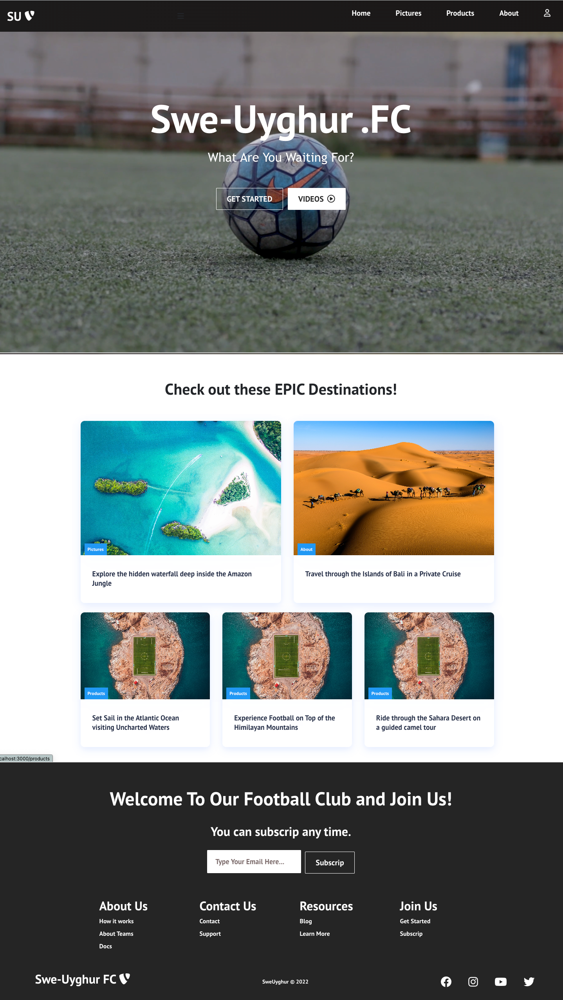

## Available Scripts for backend

In the project directory, you can run:

### `npm start`

Runs the app in the development mode.\
Open [http://localhost:5000](http://localhost:5000) to view it in your browser.

## Available Scripts for frontend

In the project directory, you can run:

### `npm start`

Runs the app in the development mode.\
Open [http://localhost:3000](http://localhost:3000) to view it in your browser.

